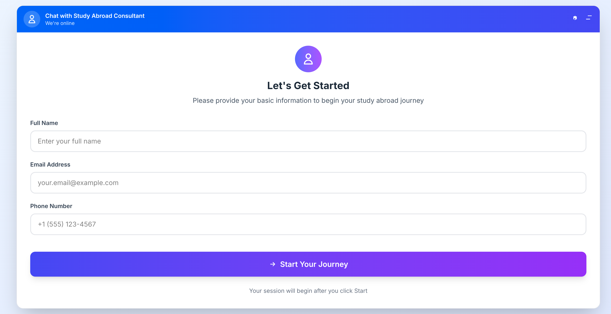
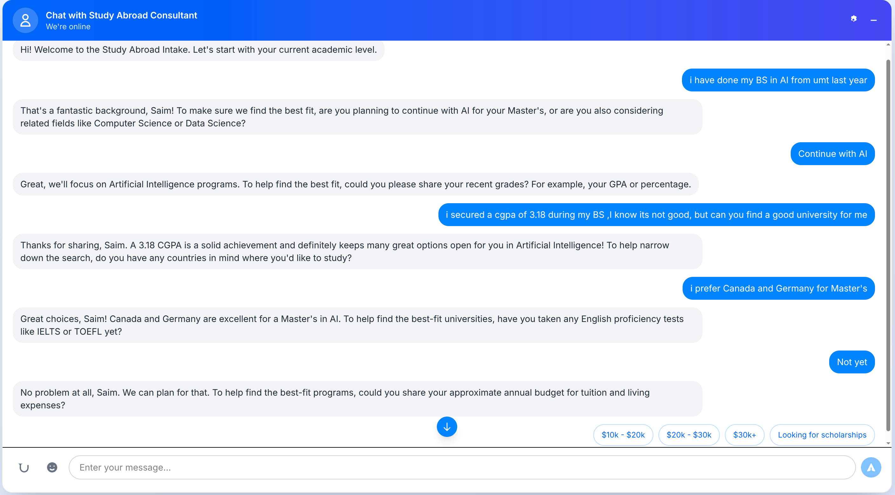

# Study Abroad Chatbot

Craft your dream study‑abroad journey with an elegant, LLM‑powered intake assistant. Built as a modern mono‑repo with a production‑ready FastAPI backend and a polished React (Vite + Tailwind) frontend.

      

## Why this project?
- LLM‑first data extraction: parse multi‑field user messages (country, budget, degree, major, GPA, year) in one go.
- Natural, context‑aware dialog: don’t re‑ask completed fields; confirm only where needed.
- Clean, normalized schema: student profiles, academic history (with major), English tests, preferences; Alembic migrations included.
- Elegant UX: Start Card, responsive chat UI, quick replies, autoscroll/scroll‑to‑bottom, compact settings.
- Thin backend: trusts the LLM output (types/constraints enforced), with rich debug logs to iterate fast.

## Screenshots



## Architecture
```
[ React (Vite + Tailwind) ]  →  [ FastAPI + LangChain (Gemini) ]  →  [ PostgreSQL ]
         UI/UX                        LLM policy + extract             normalized schema
```

Key Services
- `ExtractorChain`: Gemini‑driven JSON extraction and normalization (synonyms, levels, dates, budget ranges)
- `DialogChain`: Gemini‑driven replies + next question policy with rule fallback
- Alembic migrations; `tests/show_db.py` prints all data per session

## Live Dev Endpoints
- Backend docs: `http://127.0.0.1:8000/docs`
- Frontend dev: `http://127.0.0.1:5173`

## Repository Layout
```
backend/   FastAPI service (REST API, DB models, services)
frontend/  React UI (chat widget, Start Card, settings)
```

## Quick Start

### Backend
Requirements: Python 3.10+, PostgreSQL

1) Create venv & install deps
```bash
cd backend
python3 -m venv ../venv
../venv/bin/pip install -r requirements.txt
```

2) Configure env (`backend/.env`)
```env
POSTGRES_USER=myuser
POSTGRES_PASSWORD=mypassword
POSTGRES_DB=chatbot
POSTGRES_HOST=localhost
POSTGRES_PORT=5432

GEMINI_MODEL=gemini-2.5-pro
GEMINI_API_KEY=YOUR_GOOGLE_AI_STUDIO_KEY

REDIS_URL=redis://localhost:6379/0
LOG_LLM_DEBUG=true
```

3) Run migrations
```bash
../venv/bin/alembic upgrade head
```

4) Start backend
```bash
../venv/bin/uvicorn app.main:app --app-dir backend --host 0.0.0.0 --port 8000 --reload
```

### Frontend
Requirements: Node 20+
```bash
cd frontend
npm install
npm run dev
```
If backend isn’t `http://127.0.0.1:8000`, set `VITE_API_BASE` in `frontend/.env`.

## API Overview
- `GET /health` – health check
- `POST /api/start` – start a session (name, email, phone)
- `POST /api/message` – send/receive chat messages; persists extracted fields
- `POST /api/upload-document` – upload files (e.g., transcripts)
- `GET /api/debug/llm-key` – debug the currently loaded Gemini key suffix (when DEBUG)

## CLI Utilities
Inspect your database by session:
```bash
PYTHONPATH=backend ../venv/bin/python backend/tests/show_db.py
```

## Roadmap
- Program recommendations based on preferences + country policies
- Document parsing (OCR) and auto‑field extraction
- Multi‑tenant admin dashboard
- Docker + CI workflows

## Contributing
PRs welcome! Please open an issue to discuss significant changes first.

## License
MIT
